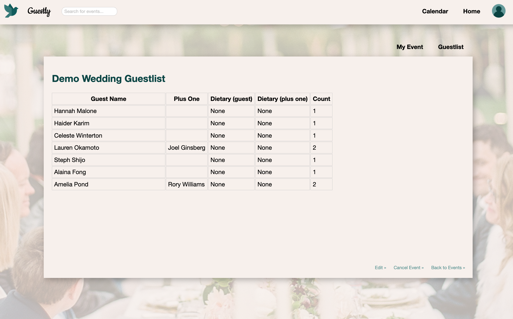
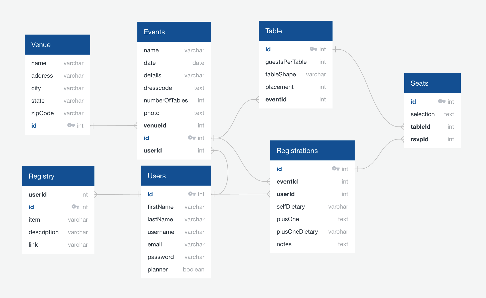

# Guestly

An events website inspired by <a href="https://www.meetup.com/">meetup.com</a> where users can RSVP and select seating at their next wedding reception. For users planning their big day, this app is a one stop shop to view your guestlist and your seating arrangements. 

<a href="https://seat-me-guestly.herokuapp.com/" target="_blank"><strong>Explore the website »</strong></a>

  
Table of Contents

  <ol>
    <li><a href="#getting-started">Getting Started</a></li>
    <li><a href="#features">Features</a></li>
    <li><a href="#future-features">Future Features</a></li>
  </ol>
 

## Technologies Used

  

## Getting started

1. Clone this repository

    `git clone git@github.com:celestewinterton/guestly.git`

2. CD into the frontend and backend directeries to install all dependencies

    `npm install`

3. In the backend directory, create a .env file, using the .env.example and update the password. To generate a new JWT_SECRET, run command:

    `openssl rand -base64 10`

4.  Create a user with the information from the .env file
 
    `psql -c "CREATE USER guestly_app PASSWORD '<password>' CREATEDB"`

5. Create the database, migrate and seed

    `npx dotenv sequelize db:create`

    `npx dotenv sequelize db:migrate`

    `npx dotenv sequelize db:seed:all`

6. In each of the frontend and backend directories, start the servers
 
    `npm start`

## Features
[Back to top](#table-of-contents)

### Splash Page & User Auth

Users can sign up for a new account, log in with an existing account, or sing in with demo to explore the site.

### Upcoming Events

On the home page, users can view all events they are planning and events they have RSVP'd to. They can click the "Plan an Event" to create add events, or can search for events to attend using the searchbar or the "Find an Event" button. 

### Event Detail 

Each event has a details page. If the user is the planner of this event, they can see the guestlist. Seating charts are a feature in development that would also be included here. 

### Guestlist

Event planner can view guests who have RSVP'd to their event.

### RSVP

If a user is not already attending an event, the event detail page will have an RSVP button that allows them to fill out details for their RSVP to this event.

### Search

Users can search for events by name, venue, or city. Search results are clickable and will redirect the user to that particular event. 

### Calendar

Users have a calendar view where they can click dates and see if there are events planned for that day.

## Database Schema
[Back to top](#table-of-contents)

## Future Features
[Back to top](#table-of-contents)

### Seating Charts 
  * This feature is currently in development and will allow a planner to create tables and assign a max capacity. 
  * Upon registering for an event, users would have the ability to select their seating preference.

### Invitations
  * Planners would send invites via email to their guestlist and show as pending until the guest has confirmed.

### Gift Registry 
  * The event details would include a new tab with a gift registry
  * Planner would be able to create, edit and delete items on the registry and guests would have read access

### Drag and Drop Visual Seating Configuration
  * To make the seating charts more intuitive, a drag-and-drop feature for tables would be enable Planners to shwo a more accurate representation of the space and provide more visibility to guests when selecting seating. 
